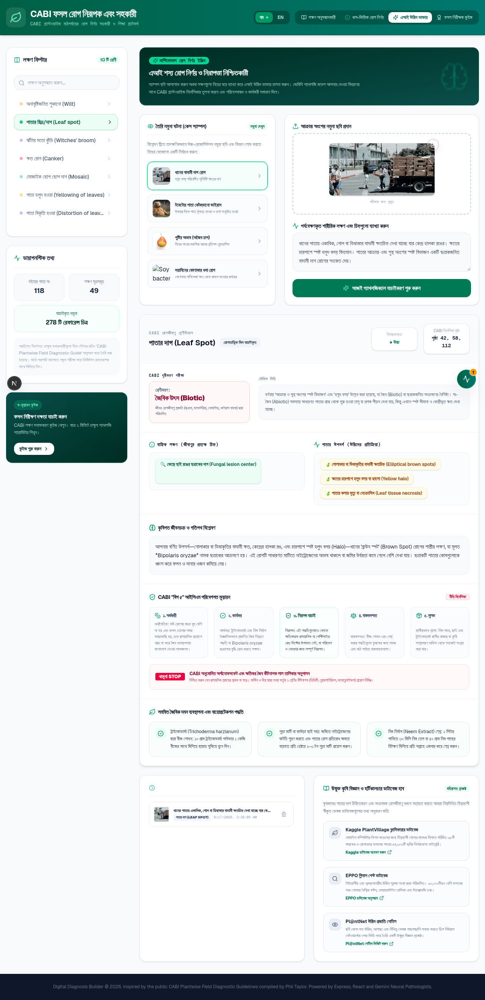

# CABI Plant Diagnosis Assistant

An interactive, AI-powered digital guide to identify crop diseases and pests using visual symptom categories from the **CABI Plantwise Field Diagnostic Guide**.

Built with **Next.js 16 + TypeScript + Tailwind CSS 4 + shadcn/ui**, and powered by **GLM-4.5V** (multimodal vision) and **GLM-4.6** (text) via the `z-ai-web-dev-sdk` — no API key required by the user (bypass SDK).



## Features

1. **Symptom Explorer** — Browse the 10 CABI visual symptom categories (Wilt, Leaf spot, Witches' broom, Canker, Mosaic, Yellowing, Distortion, Little leaf, Galls, Drying/necrosis/blight) with reference images and diagnostic text from the Plantwise Field Diagnostic Guide.
2. **AI Plant Doctor** — Multimodal (image + text) AI diagnosis with:
   - Matched CABI symptom category + confidence level
   - Biotic vs Abiotic categorization with rationale
   - Visible **Signs** (pathogen evidence) vs **Symptoms** (plant reactions)
   - CABI **Big 5** IPM assessment (Economic, Effective, Safe, Practical, Locally Available)
   - 3 organic management recommendations
3. **Step-by-Step Wizard** — Guided 3-step diagnosis flow with crop type selection and preset specimens (Cashew, Tomato, Maize, Bean).
4. **Crop Auditor Quiz** — Visual quiz that tests symptom identification skills against the CABI reference database.
5. **Local Scan History** — Persisted diagnosis logs in `localStorage` for review.

## Bilingual

- 🇧🇩 **Bangla** (default) — full agricultural Bangla translations
- 🇬🇧 **English** — toggle from the header

## Tech Stack

- **Framework**: Next.js 16 (App Router)
- **Language**: TypeScript 5
- **Styling**: Tailwind CSS 4 + shadcn/ui
- **AI**: `z-ai-web-dev-sdk` (GLM-4.5V for vision, GLM-4.6 for text) — bypass API key
- **Animations**: `motion` (Framer Motion)
- **Icons**: `lucide-react`
- **Database**: Prisma (SQLite) — scaffold only; diagnosis uses in-memory cache

## API Routes

- `GET /api/database` — Serves the CABI diagnostic database with three-tier fallback: local cache → GitHub raw fetch → offline mock.
- `POST /api/diagnose` — Multimodal AI diagnosis endpoint. Body: `{ symptomDescription: string, image?: string (base64 data URL), locale?: "bn" | "en" }`. Uses `createVision()` for image+text and `create()` for text-only, both with `thinking: enabled` for high-accuracy reasoning.

## Getting Started

```bash
# Install dependencies
bun install  # or npm install

# Run the dev server
bun run dev  # or npm run dev

# Open http://localhost:3000
```

## Project Structure

```
src/
├── app/
│   ├── api/
│   │   ├── database/route.ts      # CABI database proxy with cache + fallback
│   │   └── diagnose/route.ts      # ZAI SDK bypass diagnosis endpoint
│   ├── layout.tsx                 # Root layout + metadata
│   ├── page.tsx                   # Renders <PlantApp />
│   └── globals.css
├── components/
│   ├── PlantApp.tsx               # Main client component (5 features)
│   └── ui/                        # shadcn/ui components
└── lib/
    ├── types.ts                   # AIDiagnosisResult, DiagnosticKey, etc.
    ├── translations.ts            # Bangla/English translations
    ├── db.ts                      # Prisma client
    └── utils.ts                   # cn() helper
public/
└── output/database.json           # Cached CABI database (40KB, 118 pages)
```

## How the AI Diagnosis Works

1. User describes symptoms in Bangla or English, optionally attaches a leaf photo.
2. Backend builds a clinical pathology prompt based on the CABI Plantwise framework:
   - Match the symptom to one of 10 CABI visual categories
   - Classify as Biotic vs Abiotic based on lesion boundaries vs gradients
   - Distinguish **Signs** (pathogen evidence like fruiting bodies, sporulation, frass) from **Symptoms** (plant reactions like wilt, chlorosis, distortion)
   - Evaluate organic management options against the **Big 5** framework
3. For image inputs, the prompt + base64 image is sent to GLM-4.5V via `createVision()`.
4. For text-only inputs, the prompt is sent to GLM-4.6 via `create()`.
5. Both calls enable `thinking` mode for chain-of-thought reasoning.
6. Response is parsed as strict JSON matching the `AIDiagnosisResult` schema.
7. A heuristic offline fallback handles failures with keyword-based matching.

## License

This project is based on the CABI Plantwise Field Diagnostic Guide methodology. See [CABI Plantwise](https://www.plantwise.org) for the original guide.

## Acknowledgments

- **CABI Plantwise** for the Field Diagnostic Guide methodology
- **Phil Taylor** — compiler of the original Plantwise Diagnostic Field Guide
- Built with the Z.ai developer SDK
